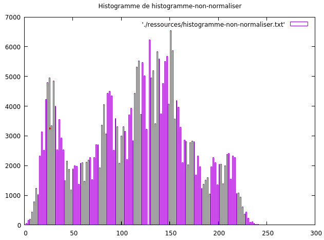
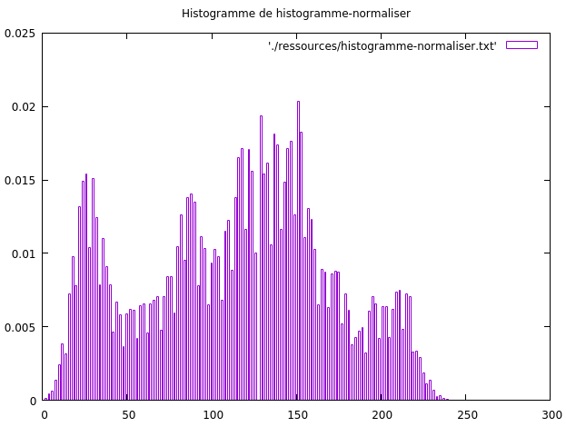
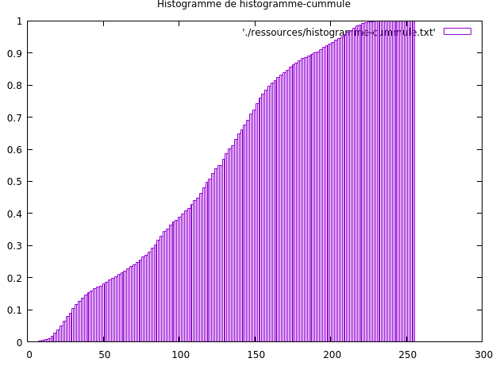
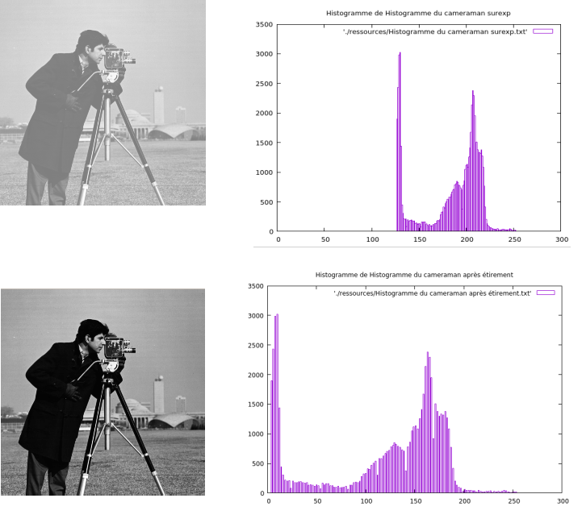
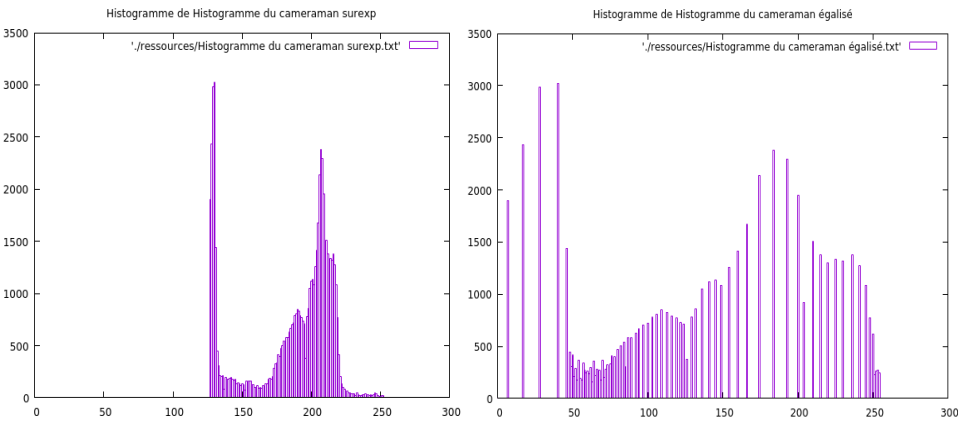

# Notes TP0 - Prise en main

## Prérequis

Pour que l'affichage des histogrammes soit plus lissible et agréable on utilise le paquet **gnuplot**.

```
sudo apt-get install gnuplot
```

Notre programme vas chercher les ressources dans le fichier du même nom. Il est donc important de crée un fichier *ressources* à la racine du projet contenant les images traitées par le programme.

Pour lancer le projet :
1. Compiler avec avec la commande **make**
2. Lancer la sortie produit par le compilateur suivie de deux images en niveau de gris (ici Lena et le cameraman).
   
   * Exemple : ```./output ./ressources/lena-baw.png ./ressources/cameraman.surexp.png ```

## Histogramme

#### Création d'un histogramme

Un **histogramme**, pour une image avec la valeur de chaque pixel codé sur **huit bits**, est un tableau de **256 cases** (de l'indice 0 à 255). Chacune de ces cases contient une valeur entière (dans le cas ou l'histogramme n'est pas encore normalisé). Cette valeur correspond au **nombre de pixels** de l'image de **valeur égale à l'indice** de la case de l'histogramme.

Pour créer un histogramme, nous avons utilisé la fonction opencv **calcHist**.

Histogramme non-normalisé obtenu :



#### Histogramme Normalisé

La **normalisation** (en valeurs de probabilité) revient à **diviser notre histogramme** non normalisé par le **nombre total de pixels** de l'image. Ainsi, la **somme des occurrences** des niveaux de gris est **égale à 1**.

Histogramme normalisé obtenu :



#### Histogramme Cumulé 

En plus du calcul de l'histogramme normalisé nous allons avoir besoin de l'**histogramme cumulé**. Pour cela, **on somme pour chaque valeur d'indice i** de l'histogramme cumulé (en niveau de gris) **la valeur d'indice i-1** précédemment calculée auquel on ajoute la **valeur à l'indice i** de l'histogramme normalisé.

Histogramme cumulé obtenu :



### Étirement d’histogramme

Le processus d'**expansion/étirement** d'histogramme vise à **améliorer la distribution des valeurs** d'un histogramme. Cela consiste à prendre un certain **Nmin** et **Nmax**, les **bornes** de l'ensemble qui contient la majorité des valeurs de l'histogramme et à **étirer** cet ensemble pour qu'il soit compris, non plus entre Nmin et Nmax, mais entre **0** et **255**. Plus concrètement, cela permet d'**augmenter le contraste** d'une image. 

Pour la calculer, il faut:

1. Récupérer les valeurs **Nmin** et **Nmax** de l'histogramme tel que la majorité des valeurs soit comprise dans l'intervalle **[Nmin,Nmax]**. 
2. On applique une transformation linéaire pour étirer l'histogramme sur toute la plage de valeurs possibles (soit dans notre cas **[0, 255]**). Tel que la formule ressemble à 
   * *I2(x,y) = 255 * (I1(x,y) − Nmin / Nmax − Nmin)* où **I1** est l'image que l'on souhaite modifié et **I2** l'image résultante de l'étirement. 
  


Ci-dessus une image de nos résultats avec pour chaque image son histogramme correspondant à droite. On peut constater qu'avec des valeurs mieux réparties sur l'ensemble des différents niveaux de gris, l'image apparaît plus nette.

### Égalisation d’histogramme

L'**égalisation** améliore la visibilité des détails dans une image en ajustant la **distribution des niveaux de gris**. L'égalisation d'histogramme vise à obtenir une **distribution d'intensité plus uniforme**, ce qui peut améliorer le **contraste** de l'image.

Pour le processus d'égalisation d'histogramme, nous avons besoin de **calculer l'histogramme cumulé**. Une fois la **CDG** (Fonction de distribution cumulative) calculée, on applique la nouvelle intensité pour chaque pixel de l'image précédente pour en créer une nouvelle.

Les images ci-dessous montre le résultat obtenu, les contrastes sont beaucoup plus claire.




## Produit de convolution et filtrage

Pour le **filtrage**, on parcourt l'image de la case **[1,1]** jusqu'à la case **[largeur-2,hauteur-2]** (en considérant que les indices vont de 0 à largeur/hauteur-1). Sur chacun des pixels parcouru, on effectue un **produit de convolution** entre les pixels de l'image et la **matrice de filtrage**.

Les photos ci-dessous appliquent respectivement au milieu un filtre de floue (**passe-bas**) et à droite un filtre de contour (**passe-haut**). 

