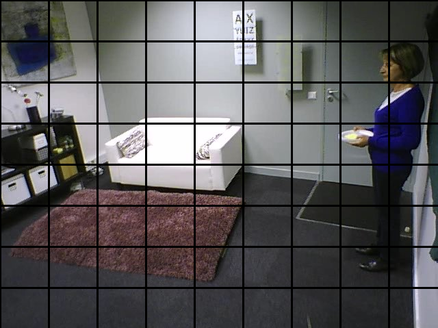
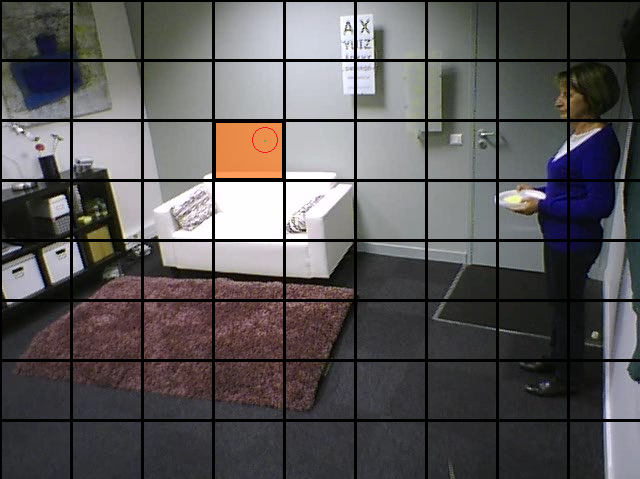

<div style="margin: 30px;text-align: justify">

# TP 1 - Segmentation

## Pose de germes

### Cadrillage image

Pour une image de dimension $(w,\ h)$:

  - $w=Nombre\ de\ pixels\ en\ largeur$
  - $h=Nombre\ de\ pixels\ en\ hauteur$

On calcul le nombre de ligne ($num\_rows$) et de colonne ($num\_cols$) que l'on peut placer dans l'image:
  
- $num\_rows=\lfloor\log_2(w)\rfloor$
- $num\_cols=\lfloor\log_2(h)\rfloor$

Comme on récupère la partie entière inférieur, cela signifie qu'on élimine des valeurs possibles lors du tirage aléatoire (deux bandes de pixels, à droite et en bas de l'image). Cependant, ces bandes sont suffisamment petites pour être ignorées sans que cela ne pose problème dans la distribution des germes (en terme de couverture de l'image).

On peut obetnir la largeur ($case\_w$) et la hauteur ($case\_h$) de chacune des cases du cadrillage:

- $case\_w=\frac{w}{num\_rows}$ 
- $case\_h=\frac{h}{num\_cols}$ 

Voici le résultat: 

<center>

</center>


### Tirage aléatoire

Pour le tirage aléatoire (distribution uniforme), on tire deux valeurs $i$ et $j$:

- $i=random([0,\ num\_rows[)$  
- $j=random([0,\ num\_cols[)$  

Ce couple $(i,\ j)$ correspond aux coordonnées d'une case du cadrillage.

Ensuite, une fois la case du cadrillage tirée, on tire aléatoirement un pixel de coordonnées $(x,\ y)$ dans cette case:

- $x=random([case\_w*i,\ case\_w*i+case\_w[)$
- $y=random([case\_h*j,\ case\_h*j+case\_h[)$

On obtient ainsi un couple d'entier $(x,\ y)$ correspondant aux coordonnées d'un pixel de l'image.

<center>

</center>

## Croissance

### Frontière 

* 4-connexe -> R l'ensemble des points de R dont au moins un des 8-voisins n'est pas un élément de R

* 8-connexe -> R l'ensemble des points de R dont au moins un des 4-voisins n'est pas un élément de R

### Prédicats

1. Fonction de Hashage 

Mise en place d'une fonction de hashage afin d'avoir une valeur unique par combinaison de couleur RGB:

$$BGR\_Hash(b,g,r)=(\sum_{i=0}^{2}b*10^{2i}+g*10^{2i+1}+r*10^{2i+2})+(b-g*r)$$

Cette fonction de hashage à été testée pour plusieurs valeur en prologue avec le programme suivant: 

```pl
# Fonction récursive pour le calcule du hash
hash_recurs(_, R, R, -1).
hash_recurs(Liste, Current, Result, Index):-
    Index>=0,
    Liste = [B,G,R],
    Calc is B*(10^(Index*2)) + G*(10^(Index*2+1)) + R*(10^(Index*2+2)),
    Current2 is Current + Calc,
    Index2 is Index - 1,
    hash_recurs(Liste, Current2, Result, Index2).

hash([], 0).
hash(L, X):-
    L = [B,G,R],
    # Domaine [1-255]
    D = [1, 2, 3, 4, 5, 6, 7, 8, 9, 10, 11, 12, 13, 14, 15, 16, 17, 18, 19, 20, 21, 22, 23, 24, 25, 26, 27, 28, 29, 30, 31, 32, 33, 34, 35, 36, 37, 38, 39, 40, 41, 42, 43, 44, 45, 46, 47, 48, 49, 50, 51, 52, 53, 54, 55, 56, 57, 58, 59, 60, 61, 62, 63, 64, 65, 66, 67, 68, 69, 70, 71, 72, 73, 74, 75, 76, 77, 78, 79, 80, 81, 82, 83, 84, 85, 86, 87, 88, 89, 90, 91, 92, 93, 94, 95, 96, 97, 98, 99, 100, 101, 102, 103, 104, 105, 106, 107, 108, 109, 110, 111, 112, 113, 114, 115, 116, 117, 118, 119, 120, 121, 122, 123, 124, 125, 126, 127, 128, 129, 130, 131, 132, 133, 134, 135, 136, 137, 138, 139, 140, 141, 142, 143, 144, 145, 146, 147, 148, 149, 150, 151, 152, 153, 154, 155, 156, 157, 158, 159, 160, 161, 162, 163, 164, 165, 166, 167, 168, 169, 170, 171, 172, 173, 174, 175, 176, 177, 178, 179, 180, 181, 182, 183, 184, 185, 186, 187, 188, 189, 190, 191, 192, 193, 194, 195, 196, 197, 198, 199, 200, 201, 202, 203, 204, 205, 206, 207, 208, 209, 210, 211, 212, 213, 214, 215, 216, 217, 218, 219, 220, 221, 222, 223, 224, 225, 226, 227, 228, 229, 230, 231, 232, 233, 234, 235, 236, 237, 238, 239, 240, 241, 242, 243, 244, 245, 246, 247, 248, 249, 250, 251, 252, 253, 254, 255],
    member(B,D),
    member(G,D),
    member(R,D),
    hash_recurs(L, 0, X2, 2),
    X is X2 + (B-G*R).
```

Exemple:

```pl
# Calculer la valeur du hash pour un RGB donné
calc(L, X):-
    L = [B,G,R],
    hash_recurs(L, 0, X2, 2),
    X is X2 + (B-G*R).
```

```pl
?- calc([220, 130, 255], X).
X = 272896090.

?- findall(S,hash(S,272896090),L), length(L,N).
L = [[220, 130, 255]],
N = 1.
```

2. Ratio de proximité 

Pour déterminer à quel point deux couleurs RGB sont proches en utilisant leur hash, on effectue un ratio qui nous donne un pourcentage (valeur comprise entre 0 et 1):

$$Proximity\_Ratio(h_1, h_2)=\frac{min(h_1,h_2)}{max(h_1,h_2)}$$

Plus la valeur est proche de 1 plus les deux couleurs sont proches l'une de l'autre. 

On arrive au prédicat suivant:

$$Predicat(h_1,h_2,threshold)=(Proximity\_Ratio(h_1,h_2)>=threshold)$$


## Fusion

## Multi-threading

## Source 

* [University of Nevada - region growing](https://www.cse.unr.edu/~bebis/CS791E/Notes/RegionGrowing.pdf)
* [OpenLayers - Region growing](https://openlayers.org/en/latest/examples/region-growing.html)

</div>